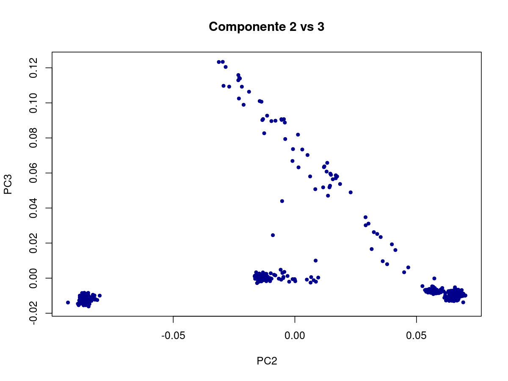
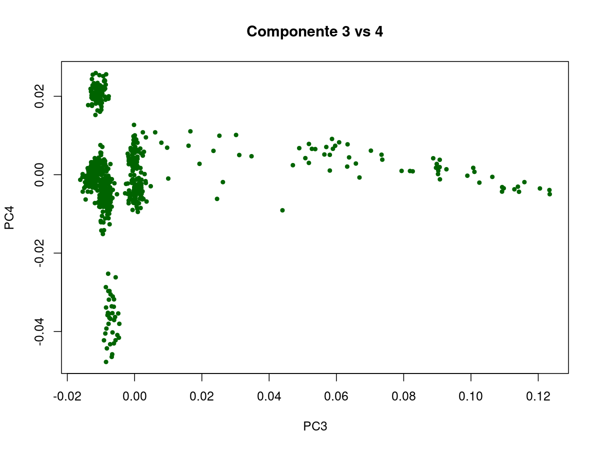

**PARTE 1**

Paso 1

1. ¿Cómo se llaman los archivos que contienen las tasas de datos perdidos por SNP y por muestra?
Los archivos generados por PLINK que contienen las tasas de datos perdidos son:
- Por muestra (individuos): plink.imiss
- Por variante (SNPs): plink.lmiss

2. ¿Cuántas variantes se eliminaron por tener una tasa de datos perdidos mayor a 0.2?
Con el comando `plink --bfile $C/chilean_all48_hg19 --geno 0.2 --make-bed --out chilean_all48_hg19_2` se eliminaron 4680 variantes debido a superar el 20% de datos faltantes.

3. ¿Cuántos individuos tenían una tasa de datos perdidos mayor a 0.02?
No se eliminó ningún individuo ya que ninguno superó el umbral del 2% de datos.

4. Basados en los histogramas y en sus cálculos, ¿qué valores umbrales de datos perdidos para muestras y SNPs sugeriría?
Un umbral para SNPs recomendaría entre 0.05 y 0.2, según el nivel de control deseado, mientras que el umbral para muestras sería de 0.02 o menor para mantener individuos con pocos datos perdidos.

Paso 2

1. ¿Cuántos individuos fueron eliminados por discrepancia de sexo?
Se eliminaron 3 individuos mediante el comando `--remove sex_discrepancy.txt --make-bed --out chilean_all48_hg19_6`, resultando en un total de 45 individuos.

2. ¿Qué riesgo(s) se corre(n) si no se eliminaran? 
Al no eliminar estos individuos con discrepancias en la identificación de sexo podría causar varios problemas en el análisis genético, como por ejemplo:
- La variabilidad genética sexual (por ejemplo, diferencias cromosomicas en X e Y puede confundir resultados si la asignacion de sexo es incorrecta).
- Puede afectar analisis dependientes de sexo como chequeos de Hardy-Weinberg por cromosomas sexuales, asociacion genética y análisis poblacionales.
- Puede introducir sesgos o errores en el calculo de frecuencias alélicas y pruebas de asociación que consideren sexo como covariable. 
- Los datos erroneos pueden disminuir la calidad y reproducibilidad del analisis genómico.

Paso 3

1. ¿Cuál es el nombre del primer conjunto de datos que solo contiene SNPs en autosomas?
`chilean_all48_hg19_7`

2. ¿Cuántos SNPs se encontraban en cromosomas sexuales?
Se encontraron 16702 SNPs en cromosomas sexuales. Esto resulta de la diferencia entre SNPs totales y SNPs en autosomas:
- SNPs totales: 574,624  
- SNPs en autosomas: 557,922  
- SNPs en cromosomas sexuales: 16,702

3. ¿Como calcularía el número de cromosomas que porta cada uno de los alelos para cada SNP?
El número de cromosomas observados es la suma total de alelos genotipados en la muestra para ese SNP. PLINK informa esta cantidad en la columna `NCHROBS` del archivo de frecuencias (`.frq`). Para cromosomas sexuales se ajusta según el sexo.  
El cálculo es:

```
\[
\text{Número de cromosomas observados} = \sum_{\text{muestras genotipadas}} \text{número de alelos por muestra}
\]
```

Paso 4

1. ¿Cuál es el nombre del archivo con los resultados de la prueba de HWE?.
El archivo generado por PLINK se llama **`plink.hwe`** y contiene los valores p y estadísticas para cada variante.

2. ¿Basándose en la distribución de los valores de p, le parece el umbral usado razonable o propondría otro valor?
- Se utilizó un umbral de `(1 \times 10^{-6}\)` para filtrar variantes que violan fuertemente el equilibrio Hardy-Weinberg, eliminando 1281 variantes.
- Este umbral es conservador y adecuado para asegurar la calidad de los datos.
- En estudios exploratorios o con muestras pequeñas, se podría usar un umbral más relajado, como `\(1 \times 10^{-4}\)` o `\(1 \times 10^{-5}\)`, para conservar más variantes.
- La elección del umbral debe balancear limpieza y cantidad de variantes restantes para un análisis robusto.

Paso 5

1. ¿Cuántos SNPs en aparente equilibrio de ligamiento se encontraron?
Se encontraron **450,182 SNPs** después de excluir las variantes en regiones de inversión conocidas y realizar el filtrado por independencia (equilibrio de ligamiento), de un total inicial de 458,097 variantes.

2. ¿Cuántos SNPs se eliminaron por estar en regiones de inversiones conocidas?
Se excluyeron **7,915 variantes** que estaban en regiones de inversiones conocidas, según el archivo `inversion.txt`.

3. ¿Cuántos individuos quedaron luego del filtro de parentesco?
 Luego de eliminar individuos por relaciones cercanas (parentezco), quedaron **42 individuos** a partir de 45 iniciales.

4. ¿Cuál fue el mayor coeficiente de parentesco efectivamente aceptado?
El mayor coeficiente de parentesco aceptado después del filtrado fue de **0.2307** (valor PI_HAT), indicando el nivel máximo permitido para mantener independencia en la muestra.

**PARTE 3**

En R, genere gráficos similares para las combinaciones Component 2 vs 3 y 3 vs 4. ¿Qué puede concluir de estos gráficos?

### Análisis de componentes principales en R

Se generaron gráficos en R usando las combinaciones de componentes principales:

- Componente 2 vs Componente 3


- Componente 3 vs Componente 4


Estos gráficos permiten visualizar la estructura de la variabilidad genética en distintas dimensiones, destacando patrones de agrupamiento o dispersión entre los individuos analizados.

#### Conclusiones de los gráficos

- La visualización de PC2 vs PC3 y PC3 vs PC4 revela detalles adicionales sobre la subestructura poblacional que no se evidencia necesariamente en PC1 vs PC2.
- Permiten identificar posibles clústeres o agrupamientos genéticos más finos y relaciones entre grupos étnicos o poblacionales.
- Si los gráficos muestran agrupamientos claros, indican diferenciación genética significativa en esas dimensiones.
- Si no hay agrupamientos definidos, puede indicar homogeneidad genética o que esas dimensiones capturan poca estructura poblacional.
- Estos gráficos complementan el análisis y ayudan a comprender mejor la diversidad genética presente.

Para realizar estos gráficos en R, se usó un archivo con los datos de componentes principales (`MDS_merge2.mds`) y comandos de graficación básica con `plot()`.

Paso 4: Realizar un análisis de ancestría

1. ¿Cuántos SNPs quedaron luego del filtro?

Luego de aplicar el filtro usando el conjunto de SNPs independientes (`indepSNP.prune.in`), quedaron **70,534 SNPs** en el dataset final.

2. ADMIXTURE asume que los individuos no están emparentados. Sin embargo, no realizamos ningún filtro. ¿Por qué?

ADMIXTURE asume que los individuos analizados **no están emparentados** para evitar sesgos en la estimación de ancestrías. La presencia de individuos emparentados puede influir en las proporciones ancestrales estimadas al sobre-representar ciertos perfiles genéticos.

Sin embargo, en este flujo de análisis **no se aplicó explícitamente un filtro para remover individuos emparentados**. Esto puede deberse a varias razones:

- El foco inicial fue el filtrado de variantes con bajo desequilibrio de ligamiento (LD), es decir, SNPs independientes.
- El filtrado de parentesco podría estar pendiente para un paso posterior.
- Es posible que el conjunto de datos usado ya cuente con suficiente representatividad o haya sido filtrado en etapas anteriores.
- Puede ser un paso que aún falta implementar.

Para un análisis adecuado con ADMIXTURE, se recomienda realizar un análisis previo de parentesco (por ejemplo, usando `--genome` en PLINK) y eliminar uno de cada par de individuos emparentados cercanamente antes de ejecutar ADMIXTURE, para evitar influencias no deseadas.

