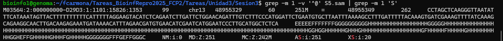
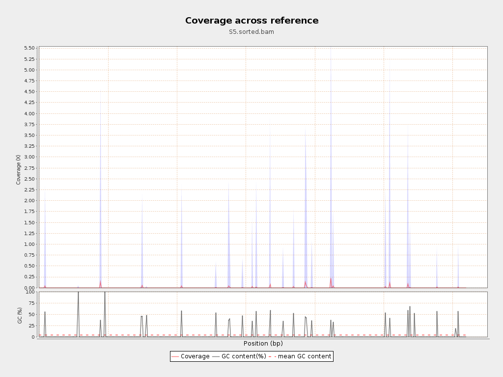
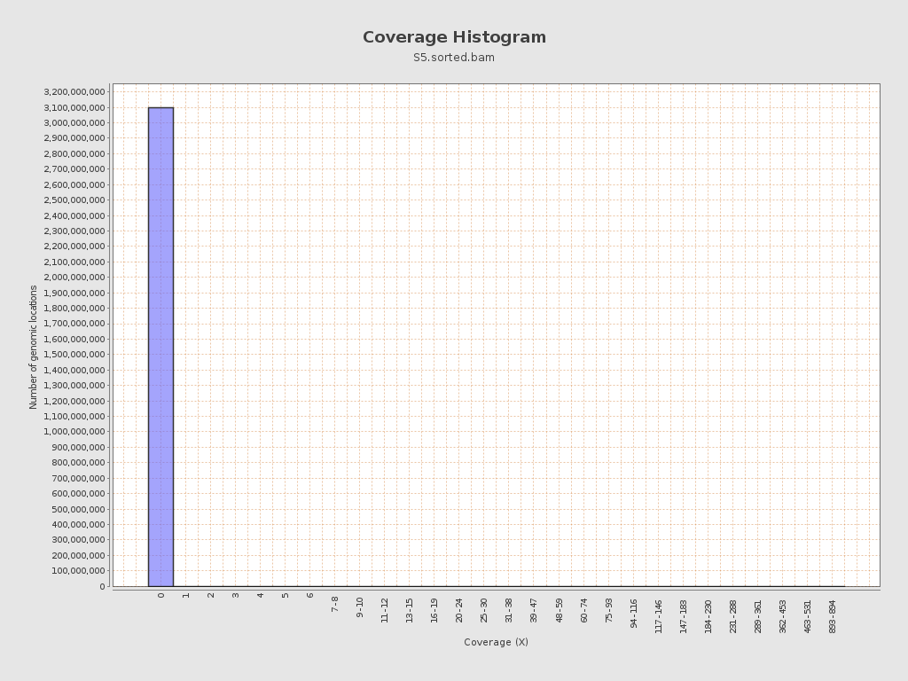
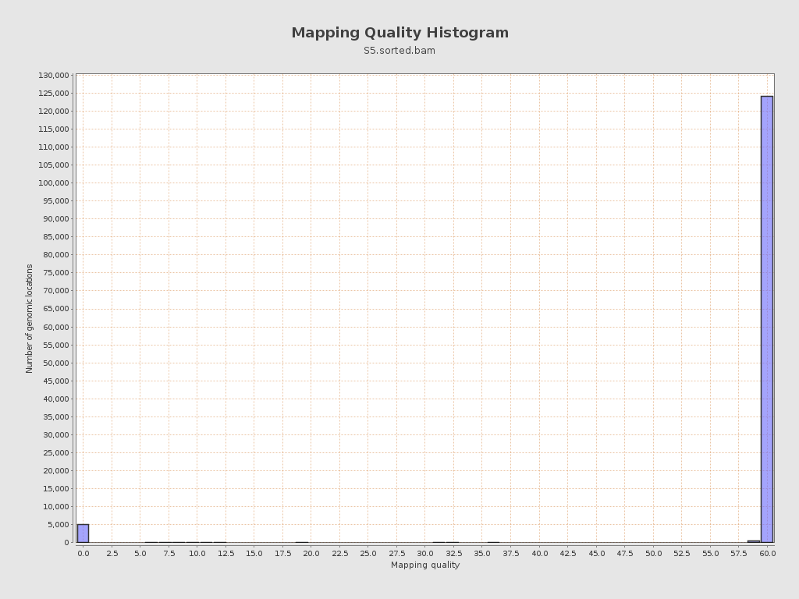
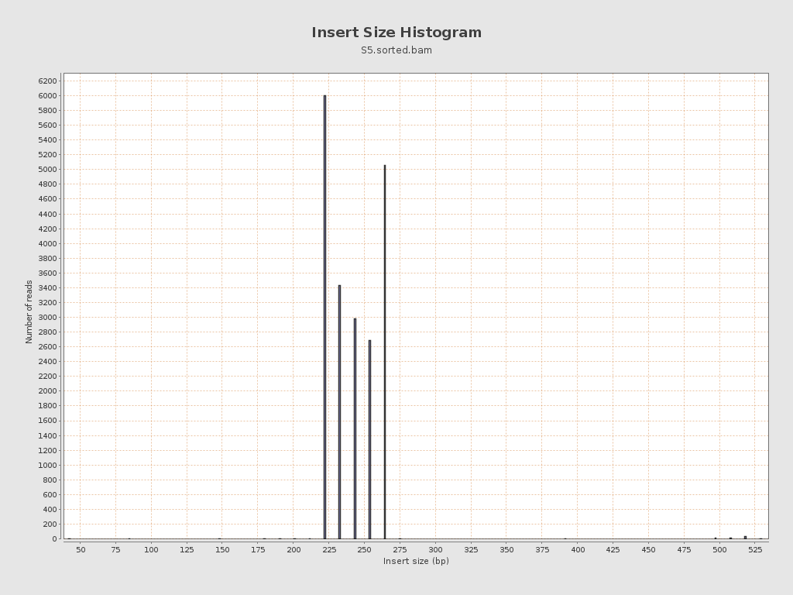

# Filtro y alineamiento de secuencias genómicas
Fabiola Carmona Pastén
Muestra a utilizar: S5

## Búsqueda de lecturas con bases enmascaradas (Soft-clipping) en el alineamiento
Para encontrar la primera lectura con bases enmascaradas (soft-clipping) en el archivo de alineamiento SAM generado, se utilizó la siguiente línea de comando: 
`grep -m 1 -v '^@' S5.sam | grep -m 1 'S'` donde se excluyen las líneas de encabezado (^@) y se filtra la primera lectura que muestra la letra S en el campo CIGAR, lo que indica la presencia de bases suavizadas por soft-clipping.
Con ello se obtiene lo siguiente:

El campo CIGAR de esta lectura es **251M**.
Interpretación del CIGAR:
- M (Match/mismatch): Indica el número de bases alineadas a la referencia (en este caso, 251 bases alineadas).
- No hay presencia del operador S (soft-clipping) aquí, por lo que este registro tiene todas sus bases alineadas.

### Reporte técnico de calidad del alineamiento
Para evaluar la calidad del alineamiento realizado, se usó la herramienta *Qualimap*: `qualimap bamqc -bam S5.sorted.bam -outdir qualimap_report_S5`. Esto generó un reporte técnico de calidad, el cual incluye métricas como porcentaje de mapeo, cobertura, distribución, profundidad y gráficos de calidad de lecturas alineadas.
El [reporte completo de Qualimap](qualimap_report_S5/qualimapReport.html) generado proporciona un resumen visual e interactivo de la calidad de los resultados de alineamiento, observándose lo siguiente:

1. **Distribución de cobertura a lo largo del genoma (Coverage across reference)**

La cobertura se mantiene relativamente uniforme en la mayoría de las regiones del genoma, con algunas zonas de cobertura reducida que podrían deberse a regiones difíciles de secuenciar o a sesgos de mapeo. La uniformidad en la cobertura es crucial para asegurar la representatividad de todo el genoma en análisis posteriores.

2. **Histograma de cobertura (Coverage histogram)**

El histograma muestra que la mayoría de las bases tienen una cobertura media-alta, lo cual indica una buena profundidad general. Se observa una cola de regiones de baja cobertura, lo que puede estar asociado a zonas repetitivas o excluidas en la preparación de la librería.

3. **Histograma de calidad de mapeo (Mapping quality histogram)**

Una alta proporción de reads presenta calidad de mapeo elevada, indicando una gran confiabilidad en el posicionamiento de las lecturas en la referencia. Sin embargo, la presencia de lecturas con menor calidad podría indicar regiones conservadas o ambiguas, incluso posibles artefactos.

4. **Histograma de tamaño de inserto (Insert size histogram)**

Este gráfico describe la distribución de longitudes de fragmentos (pares) en la muestra. La distribución del tamaño de inserto es unimodal y se encuentra en el rango esperado, lo que sugiere que la preparación de la librería fue consistente sin grandes contaminantes o fragmentos fuera de rango que pudieran afectar el análisis.

#### Conclusiones

El análisis de la calidad del alineamiento con Qualimap permitió identificar aspectos fundamentales sobre la muestra y el proceso de secuenciación. En líneas generales, la cobertura del genoma resultó bastante uniforme, lo que sugiere que la preparación de la librería y el mapeo se realizaron de manera adecuada. Sin embargo, se observaron regiones puntuales con cobertura reducida, probablemente asociadas a zonas genómicamente complejas o con limitaciones técnicas propias del experimento, lo cual puede afectar la interpretación en esos segmentos.

Asimismo, la mayoría de las lecturas presentan alta calidad de mapeo, ratificando la precisión del alineamiento, aunque la presencia marginal de lecturas con menor calidad indica que podrían existir secuencias ambiguas o repetitivas que añaden incertidumbre en ciertas regiones. La distribución del tamaño de inserto se encuentra dentro de los parámetros esperados, señalando un control riguroso durante la preparación de los fragmentos de ADN.

Estos resultados reflejan una muestra de buena calidad, pero también muestran ciertos límites que se deben considerar en análisis posteriores, especialmente al interpretar regiones con baja cobertura o calidad variable. En resumen, el reporte constituye una base sólida para avanzar en estudios funcionales o genómicos con esta muestra, siempre contando con las limitaciones inherentes observadas.

