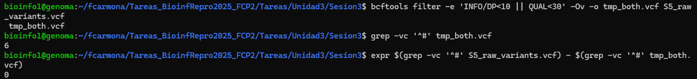

# Llamado de Variantes

Fabiola Carmona Pastén

Muestra a utilizar: S5

La selección de regiones blanco para la secuenciación se realizó sobre un panel clínico de genes, definido en el archivo BED proporcionado para esta práctica. El panel incluyó un total de **369 genes únicos**, que corresponden a los principales candidatos asociados a la sospecha clínica de los pacientes estudiados.
La lista completa de genes se presenta en la Tabla 1 y fue derivada mediante la extracción de las anotaciones genéticas del cuarto campo de `regiones_blanco.bed`.

**Tabla 1**

| Cromosoma | Inicio    | Fin       | Gen         | Categoría   |
|-----------|-----------|-----------|-------------|-------------|
| chr10     | 89624221  | 89624310  | PTEN        | CDSExon     |
| chr10     | 89653776  | 89653871  | PTEN        | CDSExon     |
| chr10     | 89685264  | 89685319  | PTEN        | CDSExon     |
| chr10     | 89690797  | 89690851  | PTEN        | CDSExon     |
| chr10     | 89692764  | 89693013  | PTEN        | CDSExon     |
| chr10     | 89711869  | 89712021  | PTEN        | CDSExon     |
| chr10     | 89717604  | 89717781  | PTEN        | CDSExon     |
| chr10     | 89720645  | 89720880  | PTEN        | CDSExon     |
| chr10     | 89725038  | 89725231  | PTEN        | CDSExon     |
| chr11     | 118307222 | 118307664 | MLL         | CDSExon     |
| chr11     | 118339484 | 118339564 | MLL         | CDSExon     |
| chr11     | 118342371 | 118345035 | MLL         | CDSExon     |
| chr11     | 118347514 | 118347702 | MLL         | CDSExon     |
| chr11     | 118348676 | 118348921 | MLL         | CDSExon     |
| chr11     | 118350883 | 118350958 | MLL         | CDSExon     |
| chr11     | 118352424 | 118352812 | MLL         | CDSExon     |
| chr11     | 118353131 | 118353215 | MLL         | CDSExon     |
| chr11     | 118354892 | 118355034 | MLL         | CDSExon     |
| chr11     | 118355571 | 118355695 | MLL         | CDSExon     |
| chr11     | 118359323 | 118359480 | MLL         | CDSExon     |
| chr11     | 118360501 | 118360969 | MLL+MLL     | UserDefined |
| chr11     | 118361905 | 118362038 | MLL+MLL     | UserDefined |
| chr11     | 118362453 | 118362648 | MLL         | CDSExon     |
| chr11     | 118363766 | 118363950 | MLL         | CDSExon     |
| chr11     | 118364997 | 118365118 | MLL         | CDSExon     |
| chr11     | 118365403 | 118365487 | MLL         | CDSExon     |
| chr11     | 118366409 | 118366613 | MLL         | CDSExon     |
| chr11     | 118366970 | 118367087 | MLL         | CDSExon     |
| chr11     | 118368645 | 118368793 | MLL         | CDSExon     |
| chr11     | 118369079 | 118369248 | MLL         | CDSExon     |
| chr11     | 118370012 | 118370140 | MLL         | CDSExon     |

La región genómica total cubierta por el panel es de aproximadamente **91120 pares de bases**, según el cálculo del tamaño acumulado de los intervalos definidos en el archivo BED. Este valor representa el espacio objetivo para la captura, enriquecimiento y posterior secuenciación, asegurando una cobertura adecuada sobre los exones y regiones de relevancia médica de los genes seleccionados.

El proceso de filtrado de variantes utilizando los criterios DP<10 y QUAL<30 no eliminó ninguna variante del archivo VCF de la muestra analizada. Esto indica que todas las variantes llamadas superan ambos umbrales mínimos de profundidad y calidad, reflejando una alta confiabilidad en la detección de variantes para esta muestra.

## Resultados de filtrado de variantes

Se realizó la detección y filtrado de variantes para la muestra analizada. En la siguiente tabla se resume el número total de variantes detectadas (totales, SNPs e INDELs), la cantidad de variantes eliminadas con el filtro de profundidad (DP<10), el filtro combinado (DP<10 o QUAL<30), y el número final de variantes que pasan ambos filtros aplicados:

| Tipo | Crudo | Eliminadas por DP<10 | Eliminadas por ambos | Pasan ambos |
|------|-------|----------------------|---------------------|-------------|
| Totales | 6 | 0 | 0 | 6 |
| SNPs    | 6  | 0  | 0  | 6 |
| INDELs  | 0| 0| 0| 0 |

En la visualización genómica mediante IGV Web (https://igv.org/app/), se seleccionó una variante detectada en el cromosoma 19 en la posición 130549481. El track de variantes (`S5_FILTERED_FINAL.vcf`) resalta la posición exacta, mientras que el track de alineamientos (`S5_sorted_RG.bam`) muestra una cobertura adecuada y la presencia de lecturas que soportan el alelo alternativo. Además, la variante se encuentra en la región correspondiente al gen CALR, lo que permite inspección directa de su contexto funcional y evidencia experimental.

Se realizó la anotación funcional de las variantes detectadas utilizando el Variant Effect Predictor (VEP) con la versión del genoma GRCh37/hg19. La distribución de las variantes según su efecto y ubicación genómica se resume en la siguiente tabla. Las categorías incluyen variantes intrónicas, río arriba (upstream), río abajo (downstream), exónicas codificantes (missense), sinónimas, UTR y otros efectos combinados:

| Consecuencia                                     | Número de variantes |
|--------------------------------------------------|---------------------|
| intron_variant                                   | 12                  |
| upstream_gene_variant                            | 10                  |
| downstream_gene_variant                          | 5                   |
| intron_variant,non_coding_transcript_variant     | 4                   |
| splice_polypyrimidine_tract_variant,intron_variant | 2                 |
| splice_polypyrimidine_tract_variant,intron_variant,non_coding_transcript_variant | 2 |
| 3_prime_UTR_variant                              | 1                   |
| 3_prime_UTR_variant,NMD_transcript_variant       | 1                   |
| 5_prime_UTR_variant                              | 1                   |
| missense_variant                                 | 1                   |
| non_coding_transcript_exon_variant               | 1                   |

Se incluyeron las anotaciones de significancia clínica (columna CLIN_SIG) y el puntaje CADD (CADD_PHRED) para todas las variantes detectadas mediante VEP. El archivo anotado fue posteriormente filtrado en R para identificar únicamente aquellas variantes con potencial impacto funcional o clínico: se seleccionaron las variantes con un valor distinto de "benign" en la columna CLIN_SIG o un puntaje CADD_PHRED superior a 20.

| Location               | SYMBOL | Consequence                                                     | CLIN_SIG | CADD_PHRED |
|------------------------|--------|-----------------------------------------------------------------|----------|------------|
| 19:17955249-17955249   | JAK3   | splice_polypyrimidine_tract_variant,intron_variant              |    -     |     23     |
| 19:17955249-17955249   | JAK3   | splice_polypyrimidine_tract_variant,intron_variant,non_coding_transcript_variant | - | 23 |
| 19:17955249-17955249   | JAK3   | non_coding_transcript_exon_variant                              |    -     |     23     |
| 19:17955249-17955249   | JAK3   | 5_prime_UTR_variant                                             |    -     |     23     |
| 19:17955249-17955249   | JAK3   | splice_polypyrimidine_tract_variant,intron_variant,non_coding_transcript_variant | - | 23 |
| 19:17955249-17955249   | JAK3   | upstream_gene_variant,splice_polypyrimidine_tract_variant,intron_variant | - | 23 |
| 19:17955249-17955249   | JAK3   | splice_polypyrimidine_tract_variant,intron_variant              |    -     |     23     |

En la muestra se detectaron variantes en el gen JAK3 asociadas principalmente a efectos de splicing e intrónicos, todas con un valor CADD_PHRED=23, considerado de alto potencial funcional, aunque sin anotación clínica disponible ("CLIN_SIG" ausente). Estas variantes podrían tener relevancia funcional, aunque no se identificó evidencia clínica patogénica directa en bases de datos automatizadas.

### Conclusiones

En la muestra estudiada, no se observaron variantes con anotación clínica de patogenicidad en las bases de datos de referencia, pero se identificaron múltiples variantes con alto puntaje CADD, todas ellas en el gen JAK3 y en categorías funcionales posiblemente relevantes (splicing, UTR, intrónica). Se recomienda una interpretación cautelosa, ya que la ausencia de anotaciones clínicas no descarta un papel funcional, y estas variantes podrían ameritar estudios adicionales (funcionales y clínicos) para determinar su impacto potencial.

