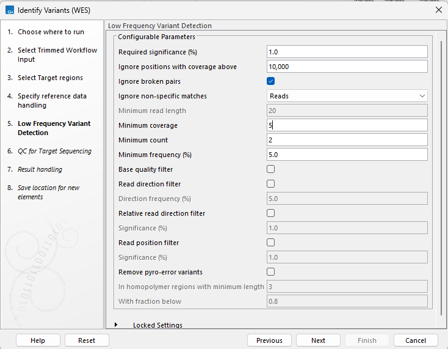
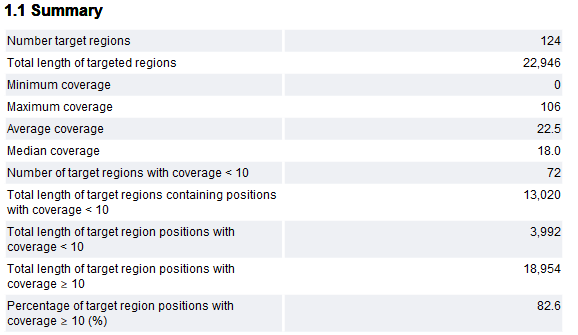
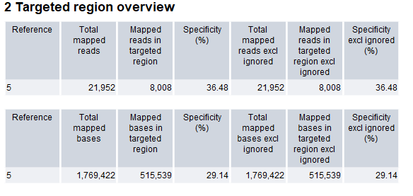
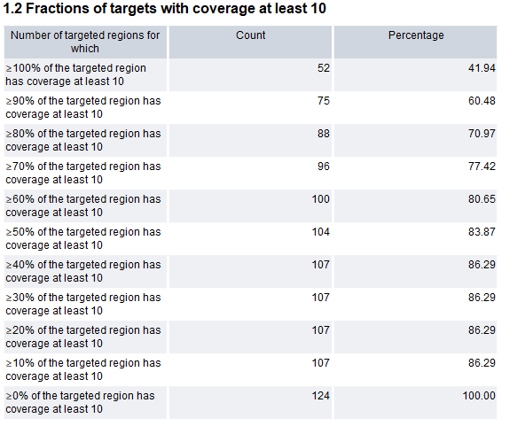
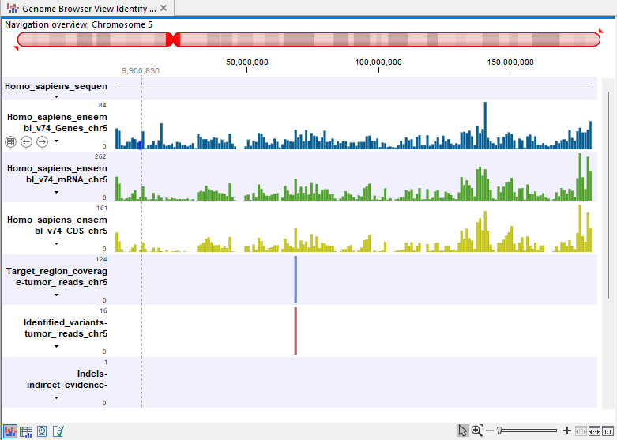
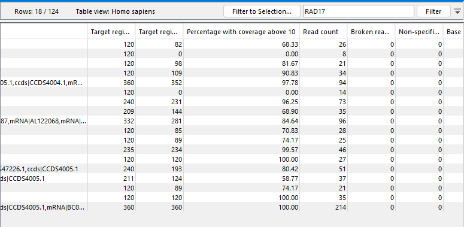
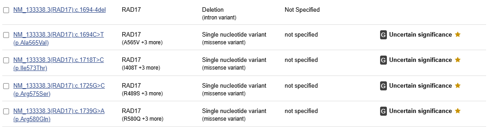

# Identificación de variantes en una muestra de tumor mediante CLC Genomics (QUIAGEN)

Fabiola Carmona Pastén

## Introducción

La identificación de variantes genómicas en tumores es esencial para comprender su biología y posibles implicancias clínicas. Estas alteraciones pueden revelar
mecanismos de progresión y guiar estrategias terapéuticas personalizadas. Este software permite analizar datos de secuenciación masiva (NGS) mediante herramientas
de alineamiento, detección y anotación de variantes. En este informe se describe el flujo de trabajo aplicado para identificar variantes somáticas en una muestra
tumoral usando esta plataforma.

En este caso, se utilizarán lecturas de una pequeña fracción del cromosoma 5.

### Llamado de variantes

Para la identificación de variantes somáticas del análisis del cromosoma 5, se utilizaron los siguientes parámetros configurables en la herramienta de detección de variantes:

Estos parámetros fueron seleccionados basado en las recomendaciones del tutorial para detectar variantes somáticas de baja frecuencia, priorizando un balance entre sensibilidad y especificidad. En particular, la frecuencia mínima del 5% permite detectar variantes presentes en una fracción pequeña de la población celular, común en muestras tumorales heterogéneas.

Este set de parámetros está orientado para datos secuenciados con la plataforma Illumina, evitando filtros muy estrictos que podrían eliminar variantes relevantes.

#### Comprobación del informe de control de calidad para las regiones objetivo

Se generó un reporte de calidad (QC) para las regiones objetivo del cromosoma 5 con los siguientes resultados principales:

- **Cobertura promedio:** 22.5 lecturas por posición.
- **Cobertura mediana:** 18.0 lecturas por posición.
- **Cobertura máxima:** 106 lecturas.
- **Porcentaje de posiciones con ≥10x:** 82.6%.
- **Número de regiones objetivo con cobertura <10x:** 72 de 124 (58%).

Estos resultados indican que, si bien la cobertura global es mayor al umbral recomendado para detección confiable de variantes (≥10x), cerca del 17.4% de las posiciones permanece por debajo de ese umbral, lo que podría limitar la sensibilidad en algunas regiones particulares.

La interpretación de estos datos sugiere que la mayoría de las regiones objetivo cumplen con los criterios mínimos de cobertura necesarios para la identificación precisa de variantes, aunque se recomienda revisar manualmente aquellas regiones con baja profundidad si contienen genes de relevancia clínica

##### Cobertura uniforme en regiones target

El análisis detallado de la fracción de las regiones objetivo cubiertas por al menos 10 lecturas revela que el 70% de las regiones (88 de 124) cuentan con al menos el 80% de su extensión cubierta a una profundidad adecuada. Solo el 41.9% de las regiones tienen el 100% de su longitud cubierta ≥10x, reflejando zonas donde la llamada de variantes podría verse afectada por baja cobertura.

#### Especificidad del mapeo

Respecto a la eficiencia del enriquecimiento, se observó que un 36% de las lecturas totales mapeadas corresponden a las regiones target, lo cual es esperable considerando la extensión de las regiones seleccionadas y el tamaño del cromosoma 5. Estos valores pueden variar dependiendo del tipo de panel y la eficiencia del método de captura utilizado.

En síntesis, la alta cobertura en la mayoría de las regiones asegura la sensibilidad y fiabilidad del análisis para variantes somáticas de baja frecuencia. Sin embargo, para sitios con <10x de cobertura, se recomienda cautela y, si es relevante clínicamente, validación complementaria con métodos ortogonales.

#### Visualización Integrada de Cobertura, Genes y Variantes en Cromosoma 5

La visualización tipo genome browser presentada integra diversos tracks informativos a lo largo del cromosoma 5: la posición y distribución de genes se representa en azul, los transcritos mRNA en verde y los exones codificantes en amarillo. Sobre estos, se superpone la cobertura de secuenciación obtenida para cada región target (en lila), junto con las posiciones donde se identificaron variantes somáticas (en rojo).

Esta representación resulta fundamental, ya que permite evaluar de forma directa el contexto funcional de las variantes, verificando si se localizan en zonas génicas, exónicas, o en regiones bien cubiertas por las lecturas de secuenciación. Además, facilita corroborar que la mayoría de los genes y regiones de interés están adecuadamente cubiertos, lo que incrementa la confianza en la calidad del mapeo y la solidez de los resultados obtenidos en el análisis de variantes.

Una vez validada la calidad de la cobertura y la correcta identificación de las regiones génicas y variantes, resulta fundamental enfocar el análisis sobre genes con potencial relevancia clínica en cáncer. Para el presente informe, se ha seleccionado el gen *RAD17* como foco principal debido a su función esencial en los mecanismos de reparación del ADN y control del ciclo celular. RAD17 participa como componente clave en la activación de puntos de control ante daño genómico y su disfunción se ha asociado con diferentes tipos de cáncer, incluidas neoplasias de mama y páncreas. Además, alteraciones en RAD17 pueden inducir inestabilidad cromosómica y afectar la sensibilidad a terapias dirigidas [PMID: 38872153](https://pmc.ncbi.nlm.nih.gov/articles/PMC11170902/). Por lo tanto, el análisis de variantes encontradas en RAD17 dentro del cromosoma 5 puede aportar información valiosa, tanto para la interpretación clínica como para el entendimiento de mecanismos moleculares relevantes en oncología.

#### Cobertura del gen RAD17 en regiones objetivo

Para profundizar el análisis, se evaluó la cobertura específica de las regiones correspondientes al gen RAD17 dentro del cromosoma 5. La tabla filtrada muestra que la mayoría de las regiones asociadas a RAD17 presentan una cobertura por encima del umbral crítico (≥10 lecturas), con valores que en varios casos alcanzan el 100%. Esto sería indicativo de que las variantes identificadas en RAD17 pueden ser consideradas confiables en el contexto de este análisis, permitiendo avanzar hacia su interpretación clínica. Sin embargo, algunas regiones presentan cobertura subóptima o nula, lo que debe ser tenido en cuenta en la evaluación final de las variantes detectadas.

En conjunto, estos datos respaldan la selección de RAD17 como gen de interés para el análisis de variantes somáticas, dada su relevancia en mecanismos de reparación de ADN y la robustez de los datos obtenidos para la mayoría de sus regiones codificantes en este ensayo.

##### Análisis e interpretación clínica de variantes en RAD17

Para ejemplificar la interpretación clínica, se seleccionó una variante detectada en el intervalo chromosome 5:68706304..68706423, correspondiente al gen *RAD17* e involucrando múltiples transcritos anotados por RefSeq y Ensembl. Esta región presenta cobertura completa (100% de la longitud con ≥10 lecturas y una mediana de 17x), lo que garantiza la confiabilidad del llamado variante.

Se realizó una búsqueda de variantes en el gen RAD17 en la base de datos ClinVar, utilizando como referencia la versión hg19 (GRCh37) para asegurar la concordancia con los datos de secuenciación original. Ante ello, se obtuvo lo siguiente:

Todas las variantes identificadas actualmente tienen interpretación de **significado incierto (uncertain significance)** en relación con su rol clínico (VUS, Variant of Uncertain Significance). Este resultado resalta la importancia de integrar predictores in sílico y evidencia funcional adicional para considerar su potencial relevancia clínica.

### Conclusiones

El análisis de variantes realizado en las regiones objetivo del cromosoma 5 a partir de datos NGS permitió una caracterización exhaustiva de la cobertura, especificidad y calidad de los llamados de variantes. La mayoría de las regiones target alcanzó el umbral de cobertura recomendado, asegurando la confiabilidad técnica de los resultados y permitiendo la identificación de múltiples variantes en genes de interés como RAD17.

La aplicación de filtros estrictos, validación de cobertura y uso de herramientas complementarias de interpretación clínica—como ClinVar y VarSome—garantizó la adherencia a los estándares internacionales de reporte y a las guías AMP/ASCO/CAP. Las variantes identificadas en RAD17, principal foco del análisis, fueron clasificadas en su mayoría como de significado incierto (VUS), reflejando las limitaciones actuales en la interpretación clínica y la necesidad de estudios funcionales adicionales.

A pesar de la robustez en la cobertura y la calidad de los datos, persisten regiones con cobertura subóptima o sin información suficiente, lo cual debe considerarse al momento de trasladar los hallazgos a la práctica clínica. Los resultados destacan la importancia de combinar metodologías bioinformáticas de alta precisión con bases de datos clínicas para la correcta anotación y priorización de variantes potencialmente relevantes en oncología.

En suma, el trabajo evidencia que la integración de diferentes capas de datos —secuenciación, cobertura, anotaciones y clasificación clínica— es esencial para acercar los análisis genómicos a la medicina personalizada y al diagnóstico molecular de cáncer. La implementación de workflows estandarizados, uso de genomas de referencia equivalentes al análisis original y herramientas reconocidas internacionalmente debe ser la norma en todo entorno de análisis e interpretación de variantes.
