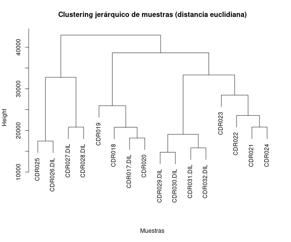
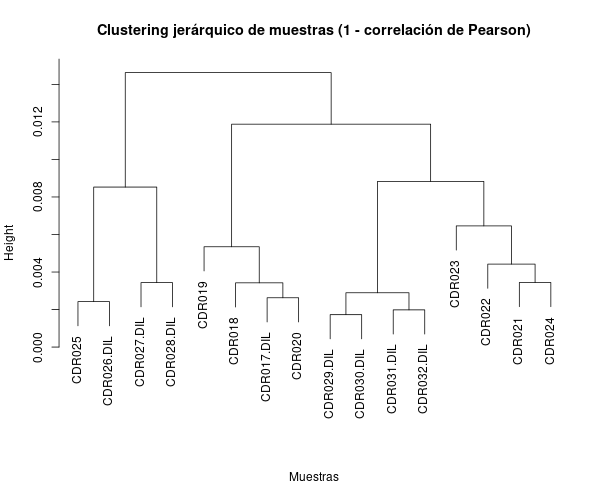
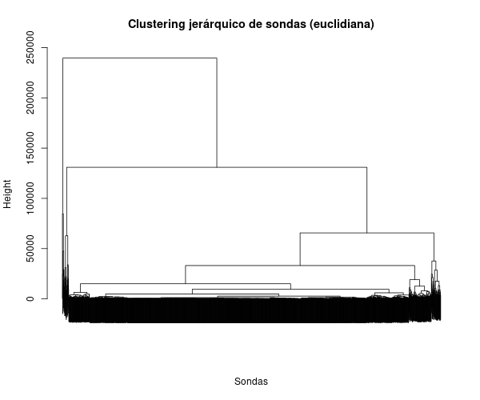
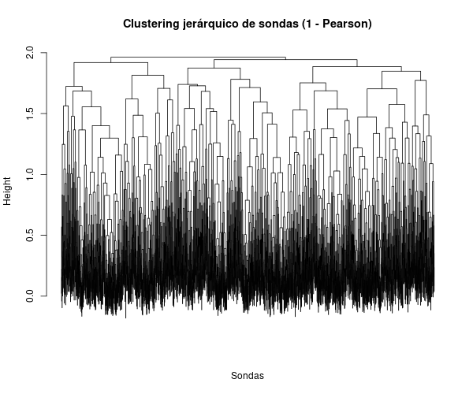
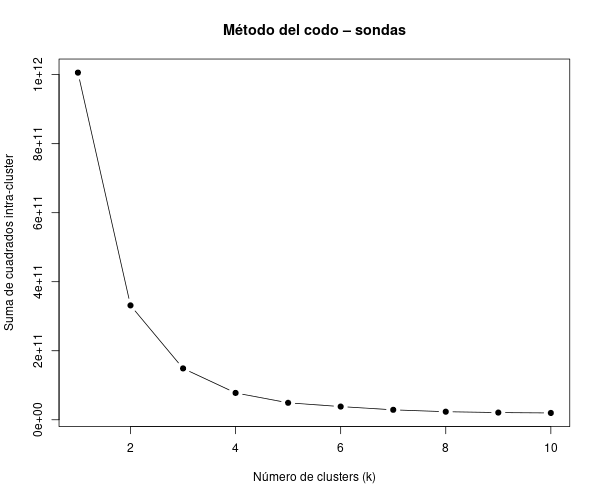
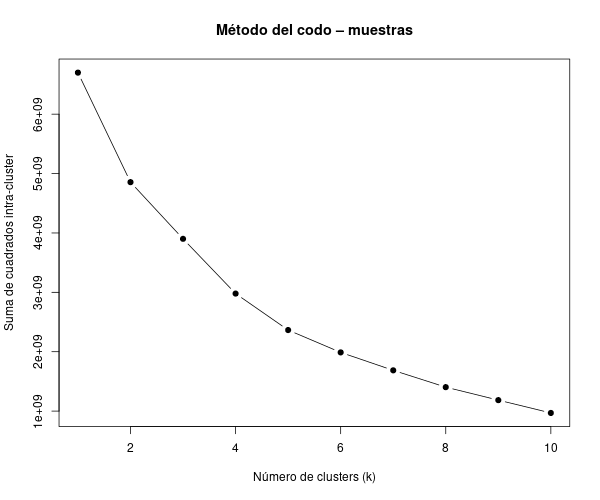
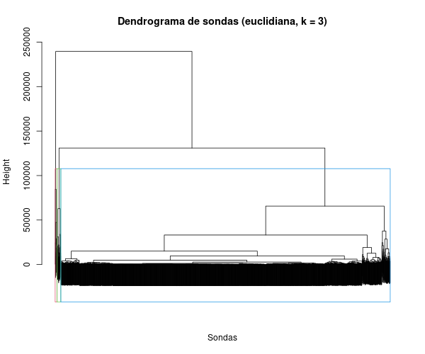
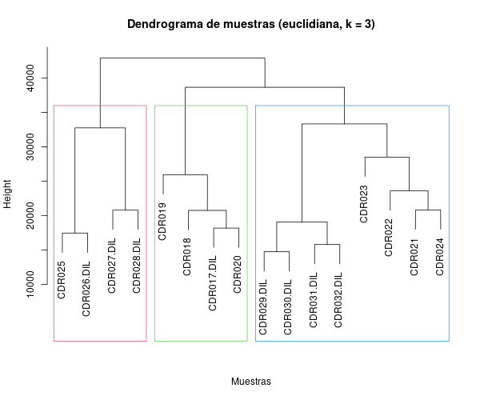

# Análisis de Clustering

Nombre: Fabiola Carmona Pastén

## Datos utilizados

Se trabajó con la matriz de expresión normalizada `output/normdata.txt`, que contiene 2477 sondas (filas) y 16 muestras (columnas), y con la tabla de diseño experimental `YChrom_design.csv`, que incluye información de genotipo, tratamiento y el factor combinado `Group`. Estas matrices se cargaron en R como objetos `mydata` y `design`, respectivamente.

## Clustering jerárquico de muestras

Para las muestras se calculó primero la distancia euclidiana sobre los perfiles de expresión normalizados y se aplicó clustering jerárquico con el método de enlace completo. El dendrograma resultante se muestra en la Figura 1.

**Figura 1.** Dendrograma de muestras con distancia euclidiana.  

Posteriormente se utilizó como medida de distancia el complemento de la correlación de Pearson, \(1 - r\), manteniendo el mismo método de enlace. El dendrograma obtenido se muestra en la Figura 2.

**Figura 2.** Dendrograma de muestras con distancia \(1 - \text{correlación de Pearson}\).  

En ambos casos las 16 muestras se agrupan en tres conjuntos principales, lo que sugiere que las combinaciones de genotipo y tratamiento influyen de forma marcada en los perfiles globales de expresión.

## Clustering jerárquico de sondas

Se aplicó la misma metodología a las sondas: cálculo de distancia euclidiana entre genes y posterior clustering jerárquico con enlace completo. El dendrograma es muy denso debido al gran número de sondas, pero permite identificar grandes ramas de genes coexpresados (Figura 3).

**Figura 3.** Dendrograma de sondas con distancia euclidiana.  

Análogamente, se construyó un dendrograma usando la medida \(1 - \text{correlación de Pearson}\), que agrupa las sondas según la similitud de sus patrones de expresión a través de las muestras (Figura 4).

**Figura 4.** Dendrograma de sondas con distancia \(1 - \text{correlación de Pearson}\).  

## Selección del número de clústeres (método del codo)

Para elegir un número adecuado de clústeres se aplicó k-means tanto a muestras como a sondas y se calculó la suma de cuadrados intra–clúster (WSS) para valores de \(k\) entre 1 y 10.  

**Figura 5.** Método del codo para sondas.  

**Figura 6.** Método del codo para muestras.  

En ambos gráficos se observa una fuerte disminución de la WSS entre \(k = 1\) y \(k \approx 3\), seguida de un aplanamiento de la curva. Con base en este “codo” se seleccionó \(k = 3\) como número de clústeres tanto para muestras como para sondas.

## Dendrogramas finales con rectángulos de clúster

Finalmente, se añadieron rectángulos a los dendrogramas jerárquicos construidos con distancia euclidiana, utilizando \(k = 3\) y la función `rect.hclust`.  

**Figura 7.** Dendrograma de sondas con rectángulos para \(k = 3\).  

**Figura 8.** Dendrograma de muestras con rectángulos para \(k = 3\).  

En el dendrograma de muestras los tres clústeres agrupan subconjuntos de muestras con perfiles de expresión y características experimentales similares, coherentes con los grupos definidos en `YChrom_design.csv`. En el dendrograma de sondas los rectángulos delimitan grandes módulos de genes coexpresados, que constituyen candidatos para análisis posteriores de anotación funcional y enriquecimiento en rutas.

## Conclusión

En conjunto, los resultados obtenidos apoyan la hipótesis inicial de que las variaciones en el genotipo y el tratamiento se reflejan en patrones de expresión génica claramente diferenciables mediante técnicas de clustering. El agrupamiento jerárquico de las muestras, utilizando tanto la distancia euclidiana como \(1 -\) correlación de Pearson, mostró tres clústeres bien definidos que coinciden de manera consistente con los grupos experimentales descritos en el diseño, lo que indica que las condiciones biológicas estudiadas ejercen un efecto global y coordinado sobre la expresión de los genes analizados. De forma complementaria, el análisis de sondas reveló módulos de genes coexpresados que también se organizan de manera estable en tres grandes grupos, y el método del codo aplicado al k-means confirmó que \(k = 3\) es un número parsimonioso de clústeres tanto para muestras como para genes, reforzando la idea de que la estructura de los datos se puede explicar de forma robusta por un conjunto limitado de estados transcripcionales asociados a las combinaciones de genotipo y tratamiento.

